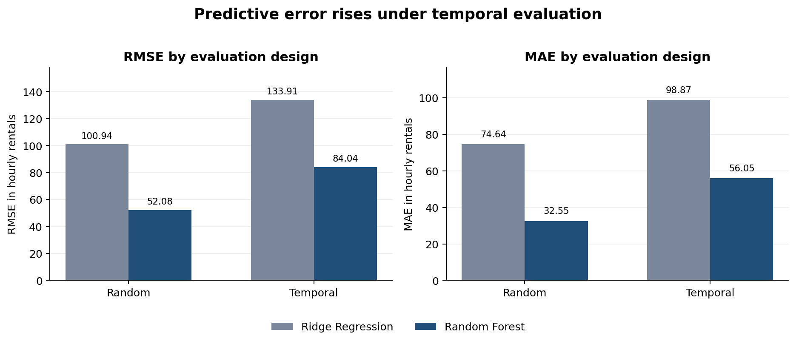

# Laboratory Question

Does changing the evaluation design change estimated predictive performance, and does it change which model appears stronger?

I compared Ridge Regression and Random Forest Regression on the UCI Bike Sharing Dataset using two 80/20 splits. One split assigned observations at random, and the other trained on the earliest observations and tested on the latest ones. The choice of split changed the estimated error for both models. It did not change the ranking, since Random Forest performed better in both evaluations. My replication verdict is **Partially Reproduced**. The results support the claim that evaluation design affects estimated performance, but the winning model did not change in this analysis.

# Research Claim and Replication Strategy

## Initial Claim

My initial claim was that Random Forest Regression would predict hourly bike rentals more accurately than Ridge Regression when both models used the same weather, calendar, and time-of-day predictors. I also expected the reported performance of both models to depend on the evaluation design. A random split mixes observations from different dates, while a temporal split tests the models on a later period. Comparing both designs would show whether the split affects the error estimates, the model ranking, or both.

## Replication Strategy

I used a **controlled partial replication** of the methodological claim in the ANLY 735 laboratory template. I kept the dataset, outcome, predictors, preprocessing steps, models, hyperparameters, metrics, test proportion, and random seed from the official Python script. The only planned change was the way observations were assigned to the training and test sets. I call this a partial replication because the analysis uses one implementation, one random split, and one temporal cutoff. It does not reproduce a separate published modeling study or repeat the test on several datasets. It is also not a proxy replication because I used the dataset, models, and evaluation procedures named in the template.

The article associated with the UCI dataset documents where the data came from. This laboratory does not try to reproduce the article's event-labeling results (Fanaee-T & Gama, 2014). Instead, I used the hourly data to test the model evaluation claim in the course template.

# Predictions Before Inspection

## Estimated Performance

Before looking at the results, I expected the temporal evaluation to have higher RMSE and MAE. With a random split, the training set includes observations from across 2011 and 2012, so the training and test sets come from a similar mix of dates. The temporal split is harder because the models must learn from earlier observations and predict a later period. Changes in demand, seasonality, or relationships among the variables could therefore increase the error.

## Model Ranking

I expected Random Forest to perform better under both designs because bike demand probably depends on nonlinear relationships among hour, working-day status, weather, season, and temperature. Ridge Regression can estimate additive linear effects after categorical variables are one-hot encoded, but the script does not add interaction terms. I expected Random Forest's lead to become smaller under the temporal split because tree-based models work best when future cases resemble patterns already present in the training data. They do not naturally extend a rising trend beyond the values they have observed.

# Data and Computational Method

## Prediction Problem

The outcome, `cnt`, is the total number of bike rentals in an hour. The analysis uses eight categorical predictors (`season`, `yr`, `mnth`, `hr`, `holiday`, `weekday`, `workingday`, and `weathersit`) and four numeric predictors (`temp`, `atemp`, `hum`, and `windspeed`). These variables could reasonably be available when making an hourly prediction.

The analysis excludes `instant`, which is an identifier, and uses `dteday` only to establish chronological order. It also excludes `casual` and `registered` because their sum defines `cnt`; including either would leak outcome information into the predictors. The data contain 17,379 hourly observations from January 1, 2011 through December 31, 2012 (UCI Machine Learning Repository, n.d.).

## Models and Preprocessing

Both models use scikit-learn pipelines. Numeric variables are filled with the training-set median when values are missing and are then standardized. Categorical variables are filled with their most frequent training-set value and one-hot encoded. Unknown categories are ignored. Keeping preprocessing inside each pipeline ensures that the test data do not influence those steps. Ridge Regression uses `alpha = 1.0`. Random Forest uses 300 trees, a minimum leaf size of 2, and `random_state = 735`.

The random design uses `train_test_split` with a 20% test set and seed 735. The temporal design sorts the observations by constructed datetime, assigns the earliest 80% to training, and reserves the latest 20% for testing. Each design therefore contains 13,903 training observations and 3,476 test observations.

| Reproducibility item | Recorded value |
|:--|:--|
| Analysis track | Python |
| Template repository commit | `fd8ce1bf8c4c02a8a5fbf2e65fb10802f9b6c86b` |
| Python | 3.12.14 |
| pandas | 2.2.3 |
| NumPy | 2.3.5 |
| scikit-learn | 1.8.0 |
| Random seed | 735 |
| Test proportion | 0.20 |
| Generated evidence | `analysis/lab01_results.csv` |

I ran the supplied script without changing its analysis. It downloaded the UCI archive, extracted `hour.csv`, created the chronological index, fit a new pipeline for each model and split, and generated the results file. I did not edit the results by hand.

# Results

Table 1 reports the evidence written by the supplied analysis script. Lower values indicate better predictive performance for both metrics.

| Evaluation Design | Model | RMSE | MAE |
|:--|:--|--:|--:|
| Random | Ridge Regression | 100.94 | 74.64 |
| Random | Random Forest | 52.08 | 32.55 |
| Temporal | Ridge Regression | 133.91 | 98.87 |
| Temporal | Random Forest | 84.04 | 56.05 |

**Table 1.** Test-set predictive errors generated by `python/lab01_analysis.py`.

{width=95%}

# FAIR Model Comparison Audit

## Frame

The task is to predict total hourly bike rentals from calendar, weather, and time-of-day information that would be available at prediction time. The outcome is `cnt`, and the two models are Ridge Regression and Random Forest Regression. Both evaluations use the same outcome, 12 predictors, preprocessing steps, model settings, metrics, 80/20 proportion, and number of observations. The only planned difference is how observations enter the training and test sets. The random design ignores temporal order, while the temporal design reserves the most recent observations for testing.

This setup answers two separate questions. First, which model has lower error within each design? Second, how much does the estimated error change when the split changes? Keeping these questions separate is important because the error levels can change even when the same model remains in first place.

## Align

The comparison is aligned within each evaluation design. Both models predict the same outcome for the same test observations, use the same predictor columns, and are scored with the same RMSE and MAE functions. Each pipeline learns its imputation, scaling, and encoding settings from the training data. The test data are not used until prediction. The script also creates new model objects for every fit, so information learned under one design is not carried into the other.

The script excludes `casual` and `registered`, which prevents a major source of target leakage. Those two columns add up to `cnt`, so including either one would make prediction unrealistically easy. Neither model receives a special predictor or a different test set within the same evaluation.

The comparison across designs still needs caution. The random and temporal test sets contain different observations because test-set composition is the feature being changed. Differences between the two designs reflect the entire evaluation setup, including different dates and demand distributions. They cannot be attributed to temporal order alone. The script also keeps the hyperparameters fixed. This makes the comparison consistent, although separate tuning might improve either model.

## Inspect

### RMSE

Root Mean Squared Error is the square root of the average squared difference between the actual and predicted rental counts. Lower values are better. Because the errors are squared before they are averaged, large misses have more influence on RMSE than small ones. This metric is useful when unusually large prediction errors are especially costly.

### MAE

Mean Absolute Error is the average absolute difference between the actual and predicted rental counts. Lower values are better. MAE can be read as the average size of a prediction error, and it is less affected by a few very large misses than RMSE.

### Performance Comparison

Under random evaluation, Random Forest is stronger on both metrics. Its RMSE is 52.08 compared with 100.94 for Ridge, a reduction of 48.86 rentals or 48.4%. Its MAE is 32.55 compared with 74.64, a reduction of 42.09 rentals or 56.4%.

Random Forest also performs better under temporal evaluation. Its RMSE is 84.04 compared with 133.91 for Ridge, a reduction of 49.87 rentals or 37.2%. Its MAE is 56.05 compared with 98.87, a reduction of 42.82 rentals or 43.3%. The ranking therefore agrees across both metrics and both designs.

The temporal split raises Ridge RMSE by 32.97 rentals, from 100.94 to 133.91, and raises Ridge MAE by 24.23 rentals, from 74.64 to 98.87. These increases are 32.7% and 32.5%, respectively. For Random Forest, temporal RMSE rises by 31.96 rentals, from 52.08 to 84.04, while MAE rises by 23.50 rentals, from 32.55 to 56.05. Relative to its lower random-split baseline, those changes are 61.4% and 72.2%.

The size of the change depends on whether it is measured in rentals or percentages. Both models add about 32 RMSE units and 24 MAE units under the temporal split. Random Forest has the larger percentage increase because its errors started from a much lower level in the random split. It still performs better, but its advantage becomes smaller under temporal evaluation.

## Review

### Model Ranking

The model ranking does not change. Random Forest has lower RMSE and MAE under both evaluations. For this dataset, predictor set, model setup, and pair of splits, Random Forest is consistently the stronger model.

### Estimated Predictive Performance

The estimated performance does change. Based only on the random split, Random Forest misses by about 33 rentals on average and Ridge misses by about 75, as measured by MAE. In the temporal split, those errors rise to about 56 and 99 rentals. The random split therefore makes both models look more accurate than they are when predicting the later period.

### Deployment Relevance

The temporal design is closer to a real use case in which a model is trained on past observations and then used to predict future hours. Later observations cannot affect preprocessing or model fitting. The random design can still measure how well a model predicts held-out cases from the same broad historical period, but it does not reproduce the past-to-future boundary of deployment.

# Diagnosis of the Difference

Random allocation places hours from both years in the training and test sets. For example, the model may predict one observation from late 2012 after learning from other late-2012 observations with similar calendar, weather, and demand conditions. The rows remain separate and preprocessing uses only the training data, so this is not direct leakage. Still, it is an easier task than predicting an entirely later period.

The temporal split trains on observations through August 7, 2012, and tests on observations from August 7 through December 31, 2012. A descriptive check shows that average hourly demand is 174.64 rentals in the temporal training period and 248.75 in the test period, an increase of 42.4%. In the random split, the training and test means are nearly the same at 189.57 and 189.02 because both samples cover almost the full two-year period. The higher demand in the later period helps explain why both models have more error under the temporal design.

The seasonal mix also differs. The temporal test set contains mostly late-summer, fall, and winter observations, while the random split spreads months and seasons across both samples. Month and season indicators can represent repeating patterns, but those patterns may not remain stable when the overall level of demand changes. The `yr` indicator distinguishes 2011 from 2012, but it cannot capture every change within a year or every changing relationship among predictors.

Random Forest can learn nonlinear relationships among hour, working-day status, weather, and season, which likely helps it outperform Ridge in both evaluations. However, each tree predicts from outcomes represented in its leaves, so the model does not naturally extend a rising demand trend beyond the training data. Ridge can extend a linear trend through its coefficients, but its additive form may miss important interactions. This combination offers a reasonable explanation for why the temporal split increases the errors without changing the ranking.

# Revised Research Claim

For this UCI hourly bike rental dataset, predictor set, model setup, and pair of 80/20 splits, Random Forest has lower RMSE and MAE than Ridge Regression. Both models perform worse when the latest 20% of observations are used as the test set. Their absolute increases in error are similar, but Random Forest has the larger percentage increase because it begins with lower error under the random split. The model ranking is stable in this experiment, but the random-split results should not be treated as estimates of performance on a later period.

# Replication Verdict

## Verdict

**Partially Reproduced**

## Defense of Verdict

The results reproduce the claim that evaluation design can change estimated predictive performance. Ridge Regression's RMSE rises from 100.94 under random evaluation to 133.91 under temporal evaluation, and its MAE rises from 74.64 to 98.87. Random Forest's RMSE rises from 52.08 to 84.04, and its MAE rises from 32.55 to 56.05. These differences matter in practice because they change the expected size of an hourly prediction error. A decision based only on the random split would overstate how well either model predicts the later period.

The second part of the claim is not reproduced in this run because changing the split does not change the winning model. Random Forest ranks first under both designs and on both metrics. Its percentage advantage becomes smaller under temporal evaluation, but it remains clearly ahead. In this comparison, the evaluation design changes the error estimates without changing the ranking.

The verdict is partial because one dataset, one 80/20 cutoff, one random seed, and fixed model settings cannot show that model rankings are generally stable or unstable. The results are enough to question conclusions based only on the random split. Repeated temporal evaluations would be needed to see whether the same pattern holds across different prediction dates and seasons.

# Extension

A useful next step would be **rolling-origin evaluation** instead of a single temporal cutoff. I would choose several monthly prediction dates in 2012, train each model on all observations available before each date, and test it on the following month. I would keep the models and predictors fixed and record RMSE and MAE for every test month.

The current August cutoff mixes the effect of the evaluation design with the particular months and demand conditions in the test period. Using several prediction dates would show whether the increase in temporal error and Random Forest's lead continue across different seasons. It would also produce a range of errors instead of a single estimate. Those results would give a clearer picture of how consistently each model predicts future months and whether the advantage depends on when the forecast begins.

# Claim Boundary

## What the Evidence Supports

The results support a limited claim: Random Forest has lower RMSE and MAE than Ridge Regression for this bike rental task under both tested splits, and the temporal split produces higher estimated errors for both models.

## What the Evidence Does Not Support

The results do not show that Random Forest is always superior. They also do not show that random-split metrics represent future deployment error, that temporal evaluation always changes the winning model, or that time alone caused the observed differences. The findings may not apply to other cities, years, forecast horizons, predictor sets, or tuning procedures.

# Researcher Takeaway

Evaluation design affects what the performance metric means. In this analysis, the same model ranks first under both splits even though the estimated errors change considerably. For that reason, researchers should report both the model ranking and the error levels, using a split that reflects how the model would actually be used.

# Reproducibility Check

- [x] Used the official ANLY 735 template repository.
- [x] Used the Python analysis track.
- [x] Ran the supplied analysis successfully.
- [x] Did not manually alter the generated results.
- [x] Recorded RMSE and MAE from the generated evidence.
- [x] Compared both evaluation designs.
- [x] Completed the FAIR Model Comparison Audit.
- [x] Defended a replication verdict with empirical evidence.
- [x] Distinguished model ranking from estimated predictive performance.
- [x] Proposed a specific and feasible extension.
- [x] Rendered and reviewed the Word report.
- [ ] Create the individual GitHub repository and push the completed reproducibility record.
- [ ] Submit the final Word document to Canvas.

# References

Fanaee-T, H., & Gama, J. (2014). Event labeling combining ensemble detectors and background knowledge. *Progress in Artificial Intelligence, 2*, 113-127. https://doi.org/10.1007/s13748-013-0040-3

UCI Machine Learning Repository. (n.d.). *Bike Sharing dataset*. https://archive.ics.uci.edu/dataset/275/bike+sharing+dataset
